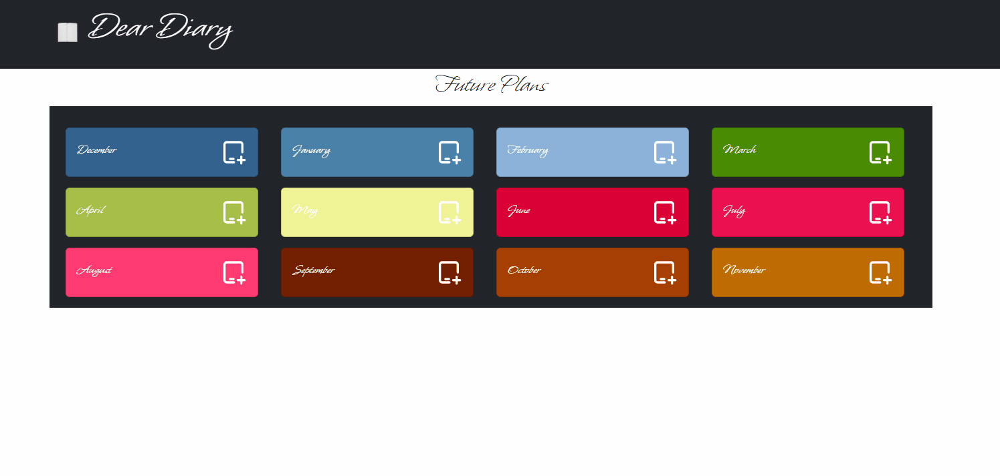

# Dear Diary
This project is a website created using React and React-Bootstrap.
This application allows you to add tasks to specific months, enter date and task information, and edit or delete existing tasks.
## Screenshots
 

[Dear Diary Live Page](https://dear-diary-esma.netlify.app/)

## Tech/framework used
<b>Built with</b>  
 
 

## Description
In the project directory, you can run:
### `npm start`
Runs the app in the development mode.\
Open [http://localhost:3000](http://localhost:3000) to view it in your browser.

 
